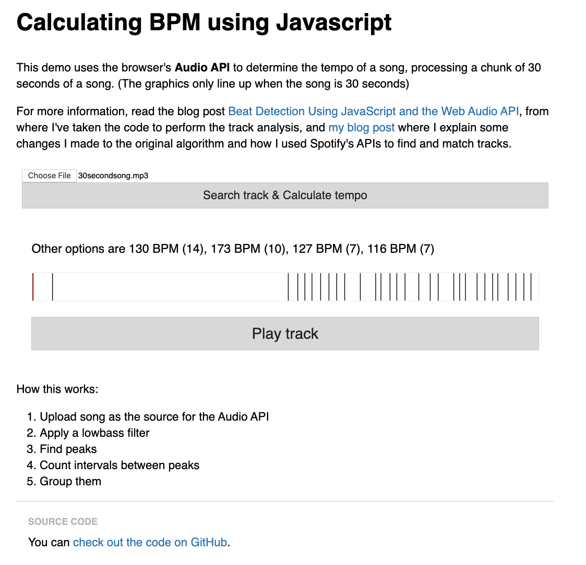

Calculating BPM using Javascript
========================================================

This project uses the browser's Audio API to guess the tempo of a song, processing a chunk of 30 seconds of music. For more information, read the blog post [Beat Detection Using JavaScript and the Web Audio API](http://joesul.li/van/beat-detection-using-web-audio/), from where I've taken the code to perform the track analysis. The author has written a [post explaining the project more in depth](https://jmperezperez.com/bpm-detection-javascript/).

Original project cloned from https://github.com/JMPerez/beats-audio-api. You can see a **demo** on [https://jmperezperez.com/beats-audio-api](https://jmperezperez.com/beats-audio-api)

## Demo

I changed it to allow your own inputs. Output download a file with all song data of beats timestamp and volume in `./exampleOutput.txt`. The graphics only line up when you input a 30 second song.

## Run it yourself

Open index.html
